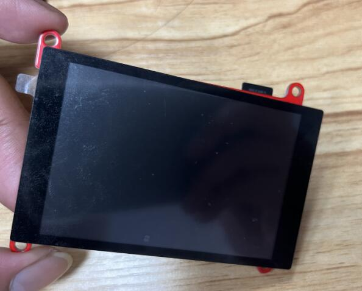
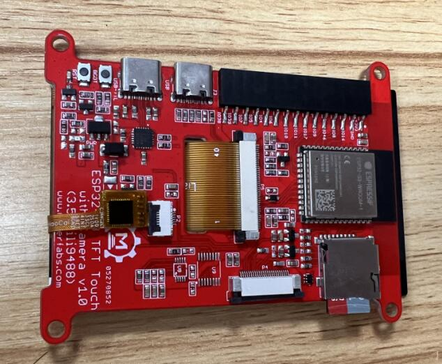
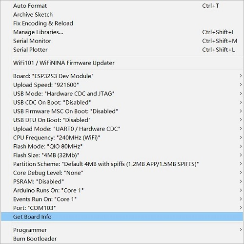

# Makerfabs ESP32-S3 SPI TFT with Touch

```c++
/*
Version:		V1.4
Author:			Vincent
Create Date:	2022/7/13
Note:
			2022/12/29	V1.4: Change wiki link
			2022/10/10	V1.3: Add Touch Keyboard demo and Back Light demo.
			2022/8/19	V1.2: Add hardware file.
			2022/8/18	V1.1: Add two demo.
			
*/
```



[toc]

# Makerfabs

[Makerfabs home page](https://www.makerfabs.com/)

[Makerfabs Wiki](https://wiki.makerfabs.com/)

# Makerfabs ESP32-S3 SPI TFT with Touch
## Intruduce

Product Link ：[ESP32-S3 SPI TFT with Touch 3.5'' ILI9488](https://www.makerfabs.com/esp32-s3-spi-tft-with-touch-ili9488.html)

Wiki Link : [ESP32-S3 SPI 3.5" TFT with Touch](https://wiki.makerfabs.com/ESP32_S3_SPI_3.5_TFT_with_Touch.html)

The 3.5" 320x480 TFT LCD driver is ILI9488, it uses SPI line for communication with ESP32-S3. You can freely use some of GPIO, to connect the ESP32-S3 display with sensors/ actuators, suitable for IoT applications.



## Feature

- Wi-Fi (2.4 GHz band)
- Bluetooth Low Energy
- Dual high performance Xtensa® 32-bit LX7 CPU cores
- Ultra Low Power co-processor running either RISC-V or FSM core
- Multiple peripherals
- Built-in security hardware
- USB OTG interface
- USB Serial/JTAG Controller
- Arduino Compatible: You can play it with Arduino IDE
- LCD 3.5 inch Amorphous-TFT-LCD (Thin Film Transistor Liquid Crystal Display) for mobile-phone or handy electrical equipment
- LCD Driver: ILI9488(SPI)
- LCD Resolution: 320*480
- FT6236 Series ICs are single-chip capacitive touch panel controller IC with a built-in 16 bit enhanced Micro-controller unit (MCU)
- Power supply: 5V, Type-C USB
- Micro SD card slot on the board
- Dual USB Type-C: one for native USB and one for USB-to-UART
- Board size: 66mm * 85mm


# Code Explain

## Complier Option

- Install board : ESP32 .
- Install library : LovyanGFX library. 
- Use type-c use cable connect USB-TTL to PC.
- Upload codes, select "ESP32-S3 DEV Module" and "UART0"



## Firmware

### S3_9488

A simple test procedure. Touch the black area in the middle of the screen, and the screen starts showing solid colors in turn. Finally, an SD card image is displayed.


## Example

### image_display.ino

The BMP image of the SD card is displayed.


### indoor

[ESP32 Touch_Indoor Environment Expansion](https://www.makerfabs.com/esp32-touch-indoor-environment-expansion.html)

Test air temperature, humidity, and TVOC values with extension plate.


### Touch Keyboard

Added an inherited three custom keyboard keyboard Demo, including text input + key combination, numeric keypad, arrow keys + space.


### Back Light

Periodically adjust the brightness of the backlight

 